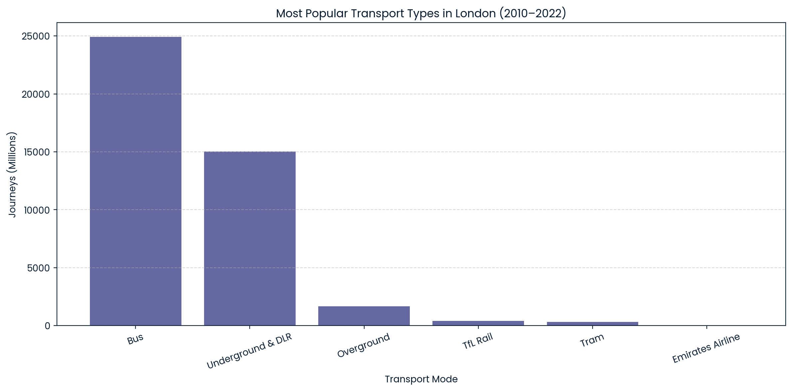
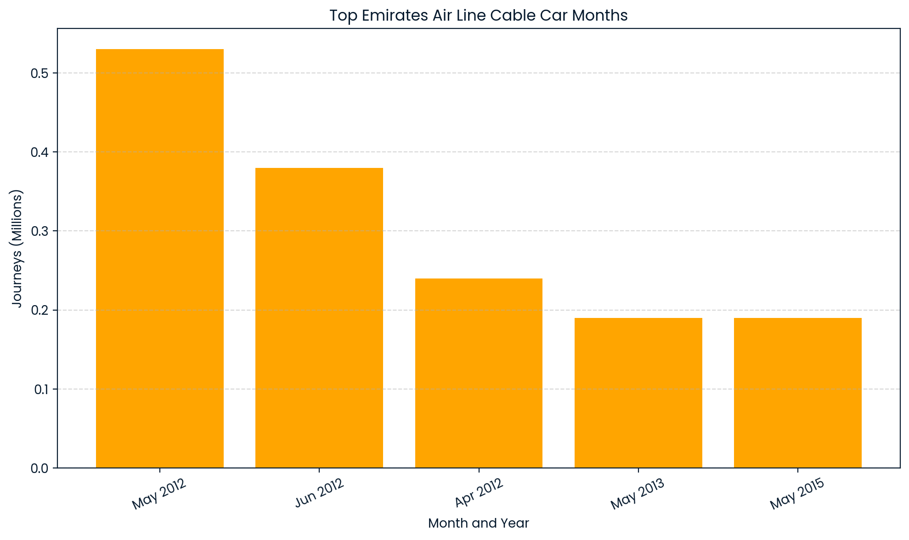

<p align="center">
  
</p>

<h1 align="center">Exploring London's Public Transport Network</h1>

<p align="center">SQL Analysis on Over 12 Years of Transport for London (TfL) Journey Data</p>

<p align="center">
  
  
  
</p>

---

## 📌 Project Description

A real-world SQL case study analyzing Transport for London (TfL) journey data collected over **12+ years**.  
The goal is to explore mobility patterns, measure transport mode popularity, and investigate the impact of major events such as COVID-19 on public travel behavior.

---

## 📌 Project Objectives

1. Identify the **most popular transport modes** in London  
2. Determine the **top months** for Emirates Air Line cable car usage  
3. Highlight the **least popular years** for Tube (Underground & DLR) journeys  

---

## 🗂 Dataset Description

| Column | Description | Type |
|--------|-------------|------|
| MONTH | Month number (1 = January) | INTEGER |
| YEAR | Year of reported data | INTEGER |
| JOURNEY_TYPE | Mode of transport (Bus, Tram, etc.) | VARCHAR |
| JOURNEYS_MILLIONS | Journey count in millions | FLOAT |

Data Source: `TFL.JOURNEYS` table provided via Snowflake.

---

## 🧠 Key Insights

- **Buses** and **Underground & DLR** remain the most relied upon transport modes in London.
- **Cable Car** travel appears **tourism-driven**, peaking during specific seasonal periods.
- A noticeable decline in Tube usage in **2020–2022** due to COVID-19 restrictions.

---

## 📊 Visual Results

### 1️⃣ Most Popular Transport Types


### 2️⃣ Emirates Air Line Cable Car – Top Usage Months


---

## 🧩 SQL Queries

All SQL scripts used in this analysis are available in:

📄 `queries.sql`

---

## 🛠 Tools & Skills Used

- SQL (Aggregation, Grouping, Filtering, Ordering)
- Basic ETL & Data Cleaning
- Data Visualization with Matplotlib
- Real-world Analytics & Interpretation

---
👤 Author

Ahmed Monir Almassri
Entry-Level Data Engineer | CE Student at IUG |
Chief Editor at IEEE Student Branch of IUG

Project created for learning, analysis, and portfolio enhancement.


## 📁 Project Structure

```bash
📂 London-Transport-SQL-Analysis
│
├─ README.md
├─ queries.sql
├─ insights.md
├─ 📂 visuals
│   ├─ transport_popularity.png 
│   └─ emirates_airline_popularity.png
└─ 📂 notebook
    └─ london_transport_notebook.ipynb
